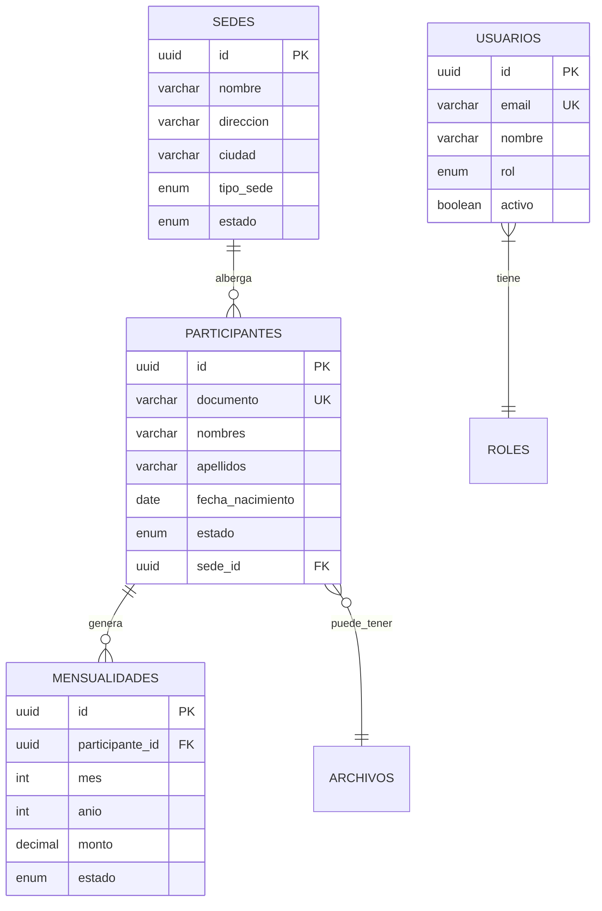

# Todo por un Alma - API REST

## 📋 Descripción

API REST desarrollada en Spring Boot para la gestión integral de la **Corporación Todo por un Alma**, una fundación dedicada al apoyo y rehabilitación de personas en proceso de recuperación por adicciones.

Esta API implementa una **arquitectura hexagonal (puertos y adaptadores)** con las mejores prácticas de desarrollo, incluyendo autenticación JWT, validaciones, logging y documentación completa.

## 🏗️ Arquitectura

### Arquitectura Hexagonal

El proyecto está organizado siguiendo los principios de la arquitectura hexagonal:

```
src/main/java/org/todoporunalma/api/
├── domain/                 # Núcleo del dominio (entidades y reglas de negocio)
│   ├── model/             # Entidades del dominio
│   └── port/              # Puertos (interfaces de repositorios)
├── application/           # Casos de uso y servicios de aplicación
│   └── service/          # Servicios de aplicación
└── infrastructure/       # Adaptadores e infraestructura
    ├── adapter/          # Adaptadores de repositorios
    ├── config/           # Configuraciones
    ├── entity/           # Entidades JPA
    ├── mapper/           # Mappers (MapStruct)
    ├── repository/       # Repositorios JPA
    ├── security/         # Configuración de seguridad
    └── web/             # Controladores REST y DTOs
```

### Tecnologías Utilizadas

- **Java 17**
- **Spring Boot 3.5.6**
- **Spring Security** - Autenticación y autorización
- **Spring Data JPA** - Persistencia de datos
- **PostgreSQL** - Base de datos
- **Hibernate** - ORM
- **JWT (JSON Web Tokens)** - Autenticación stateless
- **MapStruct** - Mapeo entre objetos
- **Flyway** - Migraciones de base de datos
- **Lombok** - Reducción de código boilerplate
- **Maven** - Gestión de dependencias

## 🚀 Instalación y Configuración

### Prerrequisitos

- Java 17 o superior
- Maven 3.6+
- PostgreSQL 12+
- IDE con soporte para Java (IntelliJ IDEA, Eclipse, VS Code)

### 1. Clonar el Repositorio

```bash
git clone <repository-url>
cd api
```

### 2. Configurar Base de Datos

Crear base de datos en PostgreSQL:

```sql
CREATE DATABASE todoporunalma_db;
CREATE USER todoporunalma_user WITH PASSWORD 'todoporunalma_pass';
GRANT ALL PRIVILEGES ON DATABASE todoporunalma_db TO todoporunalma_user;
```

### 3. Configurar Variables de Entorno

Crear archivo `.env` o configurar variables de sistema:

```bash
# Database
DB_URL=jdbc:postgresql://localhost:5432/todoporunalma_db
DB_USERNAME=todoporunalma_user
DB_PASSWORD=todoporunalma_pass

# JWT
JWT_SECRET=todoporunalma-jwt-secret-key-2024-very-long-and-secure-key-for-production
JWT_EXPIRATION=86400000
JWT_REFRESH_EXPIRATION=604800000
```

### 4. Ejecutar la Aplicación

```bash
# Compilar el proyecto
mvn clean compile

# Ejecutar tests
mvn test

# Ejecutar la aplicación
mvn spring-boot:run
```

La aplicación estará disponible en: `http://localhost:8080/api`

## 📚 Documentación Swagger/OpenAPI

### Acceso a Swagger UI

Una vez que la aplicación esté ejecutándose, puedes acceder a la documentación interactiva de Swagger:

- **Swagger UI**: `http://localhost:8080/api/swagger-ui.html`
- **OpenAPI JSON**: `http://localhost:8080/api/api-docs`

### Características de Swagger

- **Documentación interactiva** de todos los endpoints
- **Pruebas en vivo** de la API directamente desde el navegador
- **Autenticación JWT integrada** - Usa el botón "Authorize" después del login
- **Ejemplos de request/response** para cada endpoint
- **Validaciones y esquemas** de datos documentados

### Cómo probar la API con Swagger

1. **Acceder a Swagger UI**: `http://localhost:8080/api/swagger-ui.html`
2. **Hacer login**:
    - Expandir la sección "Autenticación"
    - Usar el endpoint `POST /auth/login`
    - Credenciales por defecto:
      - **Admin**: `admin@todoporunalma.org` / `password`
      - **Consulta**: `consulta@todoporunalma.org` / `password`
3. **Copiar el token JWT** de la respuesta
4. **Autorizar**: Hacer clic en el botón "Authorize" (🔒) en la parte superior
5. **Ingresar token**: Formato `Bearer {tu-token-jwt}`
6. **Probar endpoints**: Ahora puedes probar todos los endpoints protegidos

### Usuarios de Prueba

La base de datos incluye usuarios pre-configurados:

```json
{
  "admin": {
    "email": "admin@todoporunalma.org",
    "password": "password",
    "role": "ADMINISTRADOR",
    "permissions": "Lectura + Escritura + Gestión de archivos"
  },
  "consulta": {
    "email": "consulta@todoporunalma.org",
    "password": "password",
    "role": "CONSULTA",
    "permissions": "Solo lectura"
  }
}
```

### Endpoints documentados

- ✅ **Autenticación**: Login, logout, obtener usuario actual
- ✅ **Dashboard**: Estadísticas del sistema
- ✅ **Participantes**: CRUD completo con validaciones
- ✅ **Mensualidades**: Gestión de pagos mensuales
- ✅ **Sedes**: Administración de centros de rehabilitación
- ✅ **Health**: Verificación del estado del sistema

## 📊 Modelo de Datos

### Entidades Principales

#### 1. **Usuarios**
- Gestión de usuarios del sistema
- Roles: `ADMINISTRADOR`, `CONSULTA`
- Autenticación con JWT

#### 2. **Sedes**
- Centros de rehabilitación
- Tipos: `MASCULINA`, `FEMENINA`, `MIXTA`
- Estados: `ACTIVA`, `INACTIVA`, `MANTENIMIENTO`

#### 3. **Participantes**
- Personas en proceso de rehabilitación
- Vinculados a una sede específica
- Estados: `ACTIVO`, `INACTIVO`

#### 4. **Mensualidades**
- Pagos mensuales de participantes
- Estados: `PENDIENTE`, `PAGADA`, `VENCIDA`
- Restricción única por participante/mes/año

#### 5. **Archivos**
- Gestión de documentos
- Asociados a participantes
- Metadatos completos (tamaño, tipo MIME, etc.)

### Diagrama de Relaciones



## 🔐 Autenticación y Seguridad

### Sistema JWT

La API utiliza JSON Web Tokens para autenticación stateless:

1. **Login**: `POST /api/auth/login`
2. **Token**: Incluir en header `Authorization: Bearer {token}`
3. **Expiración**: 24 horas (configurable)
4. **Refresh**: 7 días (configurable)

### Roles y Permisos

- **ADMINISTRADOR**: Acceso completo (CRUD)
- **CONSULTA**: Solo lectura

### Endpoints Protegidos

```java
// Públicos
/api/auth/**
/api/health
/api/actuator/**

// Autenticados
/api/dashboard/**     // ADMINISTRADOR, CONSULTA
/api/participantes/** // ADMINISTRADOR, CONSULTA
/api/mensualidades/** // ADMINISTRADOR, CONSULTA
/api/sedes/**         // ADMINISTRADOR, CONSULTA
/api/files/**         // ADMINISTRADOR, CONSULTA
```

## 📡 API Endpoints

### Autenticación

```http
POST /api/auth/login
Content-Type: application/json

{
  "email": "admin@todoporunalma.org",
  "password": "password"
}
```

**Respuesta:**
```json
{
  "data": {
    "token": "eyJhbGciOiJIUzI1NiIsInR5cCI6IkpXVCJ9...",
    "user": {
      "id": "uuid",
      "email": "admin@todoporunalma.org",
      "nombre": "Administrador",
      "rol": "ADMINISTRADOR"
    }
  },
  "error": null
}
```

### Dashboard

```http
GET /api/dashboard/stats
Authorization: Bearer {token}
```

**Respuesta:**
```json
{
  "data": {
    "participantesActivos": 45,
    "mensualidadesPagadas": 120,
    "mensualidadesPendientes": 15,
    "sedesActivas": 4
  },
  "error": null
}
```

### Participantes

```http
# Listar todos
GET /api/participantes
Authorization: Bearer {token}

# Obtener por ID
GET /api/participantes/{id}
Authorization: Bearer {token}

# Crear nuevo (solo ADMINISTRADOR)
POST /api/participantes
Authorization: Bearer {token}
Content-Type: application/json

{
  "documento": "12345678",
  "nombres": "Juan Carlos",
  "apellidos": "Pérez García",
  "fechaNacimiento": "1990-05-15",
  "telefono": "3001234567",
  "email": "juan.perez@email.com",
  "direccion": "Calle 123 #45-67",
  "sedeId": "uuid-sede",
  "estado": "ACTIVO"
}
```

### Mensualidades

```http
# Listar todas
GET /api/mensualidades
Authorization: Bearer {token}

# Por participante
GET /api/mensualidades?participanteId={uuid}
Authorization: Bearer {token}

# Crear nueva
POST /api/mensualidades
Authorization: Bearer {token}
Content-Type: application/json

{
  "participanteId": "uuid",
  "mes": 3,
  "anio": 2024,
  "monto": 150000,
  "fechaVencimiento": "2024-03-31",
  "estado": "PENDIENTE"
}
```

### Sedes

```http
# Listar todas
GET /api/sedes
Authorization: Bearer {token}

# Crear nueva
POST /api/sedes
Authorization: Bearer {token}
Content-Type: application/json

{
  "nombre": "Sede Norte",
  "direccion": "Carrera 80 #30-25",
  "ciudad": "Medellín",
  "telefono": "3001234567",
  "tipoSede": "MASCULINA",
  "capacidadMaxima": 25,
  "directorNombre": "Dr. Carlos Ruiz"
}
```

## 🔧 Configuración

### application.properties

```properties
# Aplicación
spring.application.name=todoporunalma-api
server.port=8080
server.servlet.context-path=/api

# Base de Datos
spring.datasource.url=jdbc:postgresql://localhost:5432/todoporunalma_db
spring.datasource.username=todoporunalma_user
spring.datasource.password=todoporunalma_pass

# JPA/Hibernate
spring.jpa.hibernate.ddl-auto=validate
spring.jpa.database-platform=org.hibernate.dialect.PostgreSQLDialect
spring.jpa.show-sql=false

# JWT
app.jwt.secret=your-secret-key
app.jwt.expiration=86400000
app.jwt.refresh-expiration=604800000

# CORS
app.cors.allowed-origins=http://localhost:3001,https://todoporunalma.org
app.cors.allowed-methods=GET,POST,PUT,DELETE,OPTIONS
app.cors.allowed-headers=*
app.cors.allow-credentials=true
```

## 🧪 Testing

### Ejecutar Tests

```bash
# Todos los tests
mvn test

# Tests específicos
mvn test -Dtest=UsuarioServiceTest

# Tests de integración
mvn test -Dtest=*IntegrationTest
```

### Estructura de Tests

```
src/test/java/
├── unit/           # Tests unitarios
├── integration/    # Tests de integración
└── e2e/           # Tests end-to-end
```

## 🗄️ Configuración de Base de Datos

### Inicialización Automática

La base de datos se configura automáticamente mediante un único archivo SQL consolidado:

**Archivo**: `database_setup.sql` (378 líneas)
- ✅ **Esquema completo**: Todas las tablas, índices y relaciones
- ✅ **Datos iniciales**: Usuarios, sedes y participantes de ejemplo
- ✅ **Triggers automáticos**: Actualización de timestamps
- ✅ **Permisos**: Configuración de seguridad de base de datos
- ✅ **Documentación**: Comentarios detallados de cada componente

### Estructura del Esquema

```sql
-- Arquitectura hexagonal implementada en BD:
-- • fundacion: Información corporativa
-- • sedes: Centros de rehabilitación
-- • usuarios: Sistema de autenticación
-- • participantes: Personas en tratamiento
-- • mensualidades: Control de pagos
-- • archivos: Gestión de documentos
```

### Configuración Flyway

- **Estado**: Deshabilitado en producción
- **Razón**: Inicialización directa desde SQL para mayor control y velocidad
- **Alternativa**: Para desarrollo con migraciones incrementales, habilitar en `application.properties`

## 🚀 Despliegue

### Perfiles de Spring

```bash
# Desarrollo
mvn spring-boot:run -Dspring.profiles.active=dev

# Producción
mvn spring-boot:run -Dspring.profiles.active=prod
```

### Docker

```dockerfile
FROM openjdk:17-jdk-slim
COPY target/api-0.0.1-SNAPSHOT.jar app.jar
EXPOSE 8080
ENTRYPOINT ["java", "-jar", "/app.jar"]
```

```bash
# Construir imagen
docker build -t todoporunalma-api .

# Ejecutar contenedor
docker run -p 8080:8080 todoporunalma-api
```

## 📊 Monitoreo

### Actuator Endpoints

```http
GET /api/actuator/health
GET /api/actuator/info
GET /api/actuator/metrics
```

### Logging

Los logs se configuran por niveles:

```properties
logging.level.org.todoporunalma=DEBUG
logging.level.org.springframework.security=DEBUG
logging.level.org.hibernate.SQL=DEBUG
```

## 🤝 Contribución

### Estándares de Código

1. **Java Code Style**: Google Java Style Guide
2. **Commits**: Conventional Commits
3. **Branches**: GitFlow
4. **Tests**: Cobertura mínima 80%

### Proceso de Desarrollo

1. Fork del repositorio
2. Crear rama feature: `git checkout -b feature/nueva-funcionalidad`
3. Commits descriptivos: `git commit -m "feat: agregar endpoint de reportes"`
4. Push: `git push origin feature/nueva-funcionalidad`
5. Pull Request con descripción detallada

## 📞 Soporte

### Contacto

- **Email**: info@todoporunalma.org
- **Teléfono**: +57 310 457 7835
- **Website**: https://todoporunalma.org

### Reportar Issues

1. Verificar que no exista el issue
2. Usar template de issue
3. Incluir logs y pasos para reproducir
4. Etiquetar apropiadamente

## 📄 Licencia

Este proyecto está bajo la Licencia MIT. Ver `LICENSE` para más detalles.

## 🙏 Agradecimientos

- Equipo de desarrollo de Todo por un Alma
- Comunidad de Spring Boot
- Contribuidores del proyecto

---

**Versión**: 1.0.0  
**Última actualización**: 2024-01-19  
**Estado**: ✅ Producción

Para más información, consulta la [documentación técnica](docs/) o contacta al equipo de desarrollo.
# todoporunalma-api
